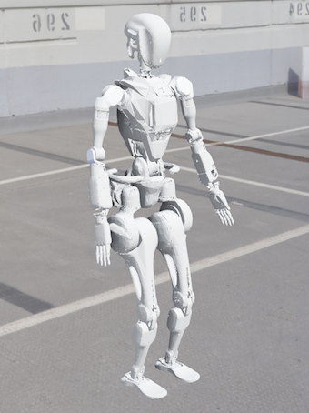

# Wiki-GRx-Gazebo




This repository provides an environment used to test the RL policy trained in NVIDIA's Isaac Gym on the GRx robot model in Gazebo.

## User Guide

1. Download and deploy `libtorch` at any location

```bash
cd /path/to/your/libtorch
wget https://download.pytorch.org/libtorch/cpu/libtorch-cxx11-abi-shared-with-deps-2.0.1%2Bcpu.zip
unzip libtorch-cxx11-abi-shared-with-deps-2.0.1+cpu.zip -d ./
echo 'export Torch_DIR=/path/to/your/libtorch' >> ~/.bashrc
```

2. Install dependency packages

```bash
sudo apt install ros-noetic-teleop-twist-keyboard ros-noetic-controller-interface ros-noetic-gazebo-ros-control ros-noetic-joint-state-controller ros-noetic-effort-controllers ros-noetic-joint-trajectory-controller
```

3. Install yaml-cpp

```bash
git clone https://github.com/jbeder/yaml-cpp.git
cd yaml-cpp && mkdir build && cd build
cmake -DYAML_BUILD_SHARED_LIBS=on .. && make
sudo make install
sudo ldconfig
```

4. Install ROS environment (One-click installation)
    - https://fishros.org.cn/forum/topic/20/小鱼的一键安装系列?lang=zh-CN

```bash
wget http://fishros.com/install -O fishros && . fishros
```

5. Clone the code

```bash
git clone https://gitee.com/FourierIntelligence/wiki-grx-gazebo.git
```

6. Build the project

```bash
catkin build
source devel/setup.bash
```

7. Running: Open a new terminal, launch the gazebo simulation environment

```bash
source devel/setup.bash
roslaunch rl_sim gazebo_gr1t1.launch
```

8. Control:
    - Press **0** on the keyboard to switch the robot to the default standing position
    - press **P** to switch to RL control mode
    - press **1** in any state to switch to the initial lying position.
    - **W** and **S** controls x-axis, **A** and **D** controls yaw, and **J** and **L** controls y-axis.
    - Press **R** to reset Gazebo environment.

## Known Issues

1. `catkin build` error info : Unable to find either executable 'empy' or Python module 'em'... try installing the package 'python-empy'
    - https://github.com/ysl208/iRoPro/issues/59
    - `catkin build -DPYTHON_EXECUTABLE=/usr/bin/python3`

## Thanks

Thanks to the following repositories for providing the code for the GRx robot model in Gazebo:

- https://github.com/fan-ziqi/rl_sar

---

Thank you for your interest in the Fourier Intelligence GRx Robot Repositories.
We hope you find this resource helpful in your robotics projects!
